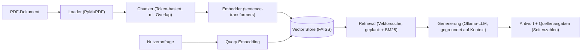

# DocuChat

Ein lokales Retrieval-Augmented-Generation-System (RAG), mit dem sich PDF-Dokumente durchsuchen und per Chat befragen lassen. Antworten werden ausschließlich auf Basis des hochgeladenen Dokuments generiert und mit Seitenangaben belegt — die Inferenz läuft vollständig lokal über [Ollama](https://ollama.com), es werden keine Dokumentinhalte an externe APIs gesendet.

## Motivation

Klassische Chatbots halluzinieren gerne, sobald sie über unbekannte Dokumente befragt werden. DocuChat begegnet dem mit einem klassischen RAG-Ansatz: Dokumente werden in referenzierbare Abschnitte zerlegt, semantisch indiziert und zur Antwortzeit als Kontext an ein lokales LLM übergeben — mit der expliziten Regel, nur auf Basis dieses Kontexts zu antworten und die Quelle (Seitenzahl) mitzuliefern.

## Funktionsumfang

| Status | Funktion |
|---|---|
| Fertig | PDF-Ingestion mit Seitenreferenzen ([PyMuPDF](https://pymupdf.readthedocs.io/)) |
| Fertig | Token-basiertes Chunking mit Overlap |
| Fertig | Lokale Embeddings ([sentence-transformers](https://www.sbert.net/), `all-MiniLM-L6-v2`) |
| Fertig | Semantische Suche über [FAISS](https://faiss.ai/) |
| Fertig | Antwortgenerierung mit Quellenangaben über ein lokales LLM (Ollama) |
| Geplant | Hybrid-Suche (Vektorsuche + BM25-Stichwortsuche) |
| Geplant | REST-API (FastAPI) |
| Geplant | Chat-Oberfläche (Streamlit) |
| Geplant | Zentrale Konfiguration (Modelle, Pfade, Ollama-Host) |

## Architektur



Der Ablauf gliedert sich in zwei Phasen:

1. **Ingestion** (einmalig pro Dokument): PDF laden → in Chunks mit Seitenreferenz zerlegen → embedden → im Vektorindex ablegen und persistieren.
2. **Retrieval & Generierung** (pro Anfrage): Anfrage embedden → relevanteste Chunks suchen → Chunks als Kontext an das LLM übergeben → Antwort mit Quellenangaben zurückgeben.

Die Trennung von Speicherzugriff (`vector_store.py`) und Suchlogik ist bewusst so gewählt, dass FAISS bei Bedarf gegen eine andere Vektordatenbank (z. B. Qdrant, pgvector) ausgetauscht werden kann, ohne den Rest der Pipeline anzufassen.

## Tech-Stack

| Bereich | Technologie |
|---|---|
| PDF-Verarbeitung | PyMuPDF |
| Chunking / Tokenisierung | sentence-transformers Tokenizer |
| Embeddings | sentence-transformers (`all-MiniLM-L6-v2`) |
| Vektorsuche | FAISS |
| Stichwortsuche | rank-bm25 *(geplant)* |
| LLM-Inferenz | Ollama, lokal (z. B. Llama 3) |
| API | FastAPI *(geplant)* |
| Frontend | Streamlit *(geplant)* |
| Validierung | pydantic |
| Tests | pytest |

## Projektstruktur

```
docuchat/
├── app/
│   ├── main.py                 # FastAPI-Einstiegspunkt (REST-API)            [geplant]
│   ├── config.py                # zentrale Konfiguration                       [geplant]
│   ├── ingestion/
│   │   ├── loader.py            # PDF-Textextraktion, seitenweise
│   │   ├── chunker.py           # Token-basiertes Chunking mit Overlap
│   │   └── embedder.py          # Embeddings für Chunks & Anfragen
│   ├── retrieval/
│   │   ├── vector_store.py      # FAISS-Wrapper: Index, Suche, Persistenz
│   │   ├── keyword_search.py    # BM25-Stichwortsuche                          [geplant]
│   │   └── hybrid.py            # Kombination aus Vektor- & Stichwortsuche     [geplant]
│   └── generation/
│       ├── prompt.py            # Prompt-Aufbau: Kontext + Zitationsregeln
│       └── llm.py               # Antwortgenerierung über Ollama
├── frontend/
│   └── streamlit_app.py         # Chat-Oberfläche                              [geplant]
├── scripts/
│   └── manual_test.py           # Manuelles End-to-End-Testskript für die Pipeline
├── tests/                       # Unit-Tests (pytest)
├── data/                        # PDFs & FAISS-Indizes (lokal, nicht versioniert)
├── docs/                        # Weiterführende Dokumentation
├── requirements.txt
└── pytest.ini
```

Diese Struktur folgt einer klaren Trennung nach Pipeline-Phase (`ingestion` → `retrieval` → `generation`), damit jede Phase unabhängig testbar bleibt und einzelne Komponenten (z. B. der Vektorspeicher oder das LLM-Backend) austauschbar sind, ohne andere Teile der Pipeline zu berühren. `app/` enthält ausschließlich die Kernlogik, `frontend/` die Präsentationsschicht — beide greifen auf dieselbe Pipeline zu, aber unabhängig voneinander.

## Erste Schritte

### Voraussetzungen

- Python 3.12+
- [Ollama](https://ollama.com) lokal installiert und gestartet
- Ein über Ollama geladenes Modell, z. B.:
  ```bash
  ollama pull llama3
  ```

### Installation

```bash
git clone https://github.com/elmahdiroudani/docuchat.git
cd docuchat

python -m venv venv
venv\Scripts\activate        # Windows
source venv/bin/activate     # macOS / Linux

pip install -r requirements.txt
```

### Tests ausführen

```bash
pytest
```

## Verwendung

Der Fokus liegt aktuell auf der Kern-Pipeline (Ingestion → Embedding → Retrieval → Generierung). Sie lässt sich end-to-end über das manuelle Testskript ausführen:

```bash
python scripts/manual_test.py
```

REST-API und Weboberfläche sind in Arbeit (siehe Roadmap).

## Roadmap

- [x] PDF-Ingestion & Chunking
- [x] Embeddings & FAISS-Vektorspeicher
- [x] Gegroundete Antwortgenerierung mit Quellenangaben (Ollama)
- [ ] Hybrid-Suche (BM25 + Vektorsuche)
- [ ] REST-API (FastAPI)
- [ ] Chat-Oberfläche (Streamlit)
- [ ] Zentrale Konfiguration (`config.py`)

## Lizenz

Noch nicht festgelegt. Wird addiert

## Autor

[elmahdiroudani](https://github.com/elmahdiroudani)
